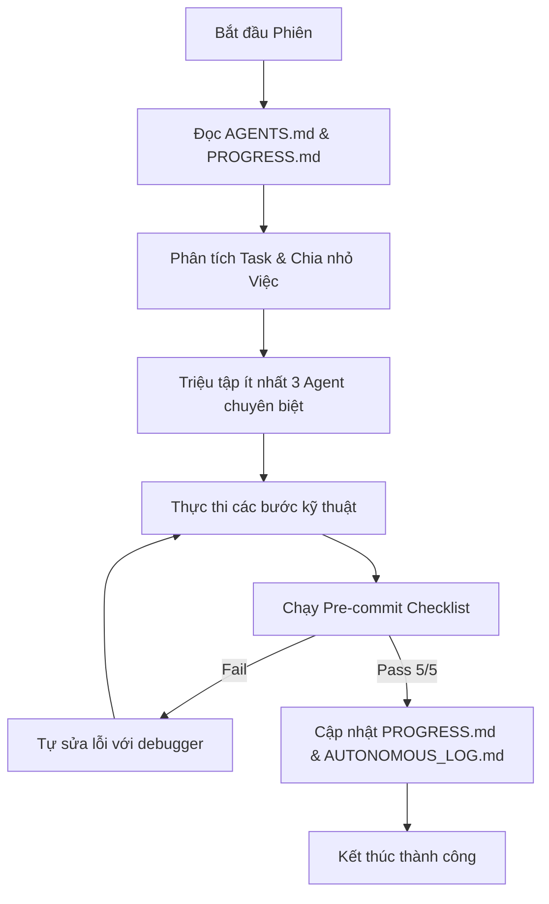

# 🤖 Workflow: Autonomous Execution

---

## 👥 Agents phụ trách:
- `orchestrator` (Chỉ huy)
- Đội ngũ Agent tương ứng với nhiệm vụ

---

## Vòng lặp Thực thi (Autonomous Loop):

```mermaid
flowchart TD
    A[Bắt đầu Phiên] --> B[Đọc AGENTS.md & PROGRESS.md]
    B --> C[Phân tích Task & Chia nhỏ Việc]
    C --> D[Triệu tập ít nhất 3 Agent chuyên biệt]
    D --> E[Thực thi các bước kỹ thuật]
    E --> F[Chạy Pre-commit Checklist]
    F -->|Fail| G[Tự sửa lỗi với debugger]
    G --> E
    F -->|Pass 5/5| H[Cập nhật PROGRESS.md & AUTONOMOUS_LOG.md]
    H --> I[Kết thúc thành công]
```
