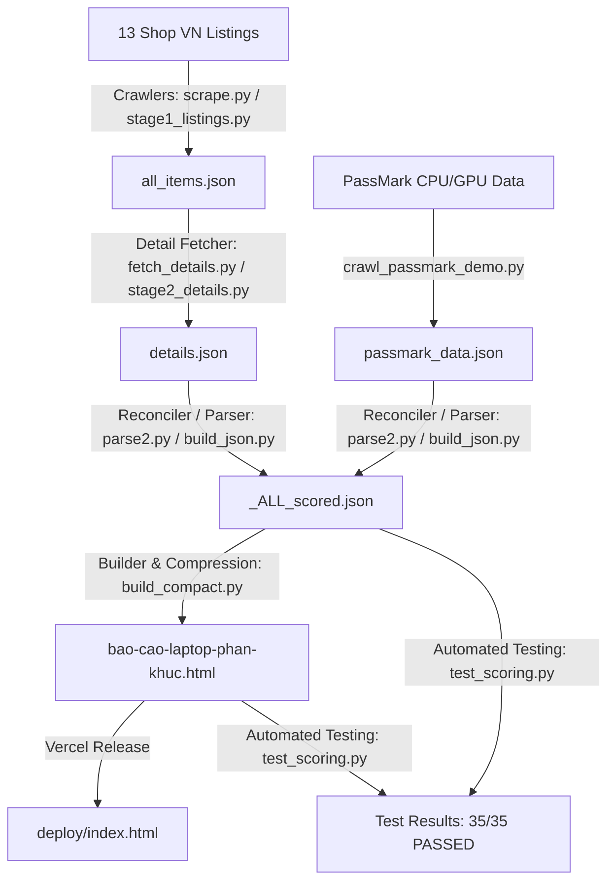

# 🗺️ CODEBASE.md — Bản đồ Kiến trúc Laptop Report VN

## 1. Tổng quan Dự án
Hệ thống crawl, chuẩn hoá, chấm điểm benchmark và trực quan hoá so sánh **3.364+ laptop** từ **13 nhà bán lẻ hàng đầu tại Việt Nam**.

## 2. Kiến trúc Luồng Dữ liệu (Pipeline Architecture)

## 3. Các thành phần mã nguồn chính

### 🕷️ Crawlers & Fetchers
- `scrape.py`, `scripts/stage1_listings.py`: Thu thập danh sách sản phẩm từ các shop.
- `fetch_details.py`, `detail.py`, `scripts/stage2_details.py`: Cào chi tiết cấu hình (PDP) và trạng thái tồn kho (CÒN / HẾT / LIÊN HỆ).
- `crawl_no1.py`, `lg_crawl.py`: Crawler đặc thù cho từng đại lý riêng lẻ.
- `crawl_passmark_demo.py`: Cào điểm benchmark PassMark CPU Mark và G3D Mark.

### 🧬 Data Parsing & Reconciliation
- `parse2.py`: Trích xuất thông số kỹ thuật (CPU family, RAM GB, SSD tier, Screen size/res/Hz/panel, Pin Wh).
- `reconcile.py`, `reconcile2.py`: Khớp sản phẩm giữa các nguồn, phát hiện trùng lặp.
- `check_missing.py`, `find_missing.py`: Phát hiện máy bị thiếu trường dữ liệu.

### 🧮 Scoring Engine & Compact Builder
- `build_compact.py`: Script nòng cốt.
  - Tính điểm các thành phần `[CPU, RAM, GPU, Display, Pin, Storage]`.
  - Nén cấu trúc dữ liệu JSON (~6x) để nhúng trực tiếp vào HTML.
  - Sinh file HTML độc lập chứa đầy đủ giao diện, dữ liệu và engine tính điểm tương tác client-side.
- `deploy/index.html`: Bản copy sẵn sàng deploy lên Vercel.

### 🧪 Testing & Verification
- `test_scoring.py`: Kiểm thử 35 invariant test cases qua Node.js và Python:
  - Test case MSI Thin 15 (AI profile).
  - Boundary cases (RAM 8-128GB, Pin 0-100Wh, Storage 256GB-2TB, Display 4K 240Hz OLED).
  - SATA SSD vs NVMe tiers.
  - dGPU vs iGPU invariant (không bonus đảo hạng).
  - Value factor và weights audit.

## 4. Bất biến quan trọng (Invariants)
1. **Clamp trần 100**: Mọi điểm thành phần (CPU, RAM, GPU, Màn hình, Pin, Storage) đều phải $\in [0, 100]$.
2. **Tổng trọng số = 1.00**: Bộ trọng số của 6 chuyên ngành $\sum w_i$ bắt buộc bằng đúng $1.00$.
3. **Value Factor**: $VF = 1.0 \pm dist \times 0.15$, luôn nằm trong đoạn $[0.85, 1.15]$.
